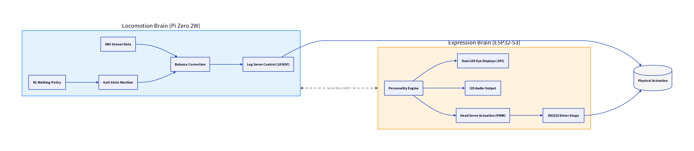
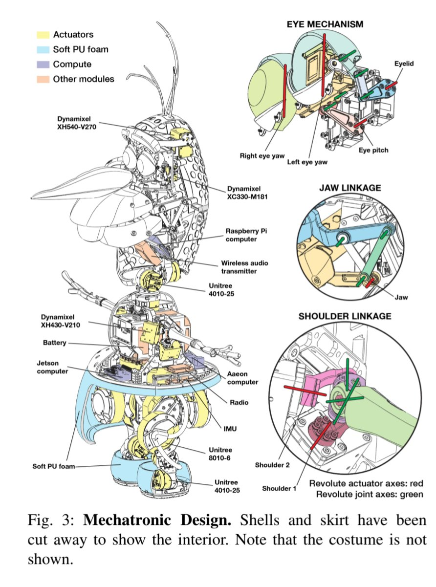
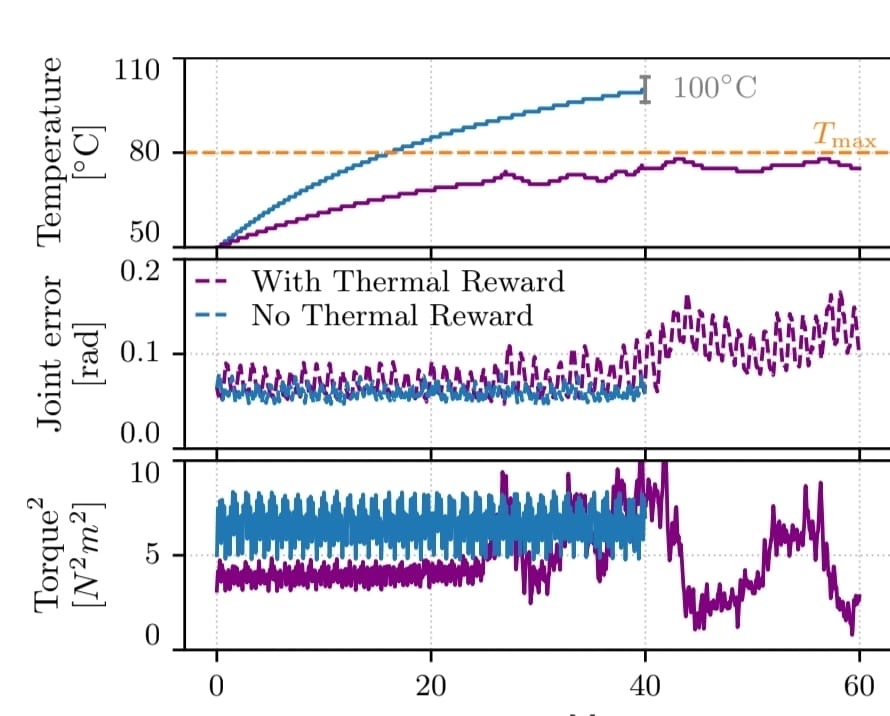
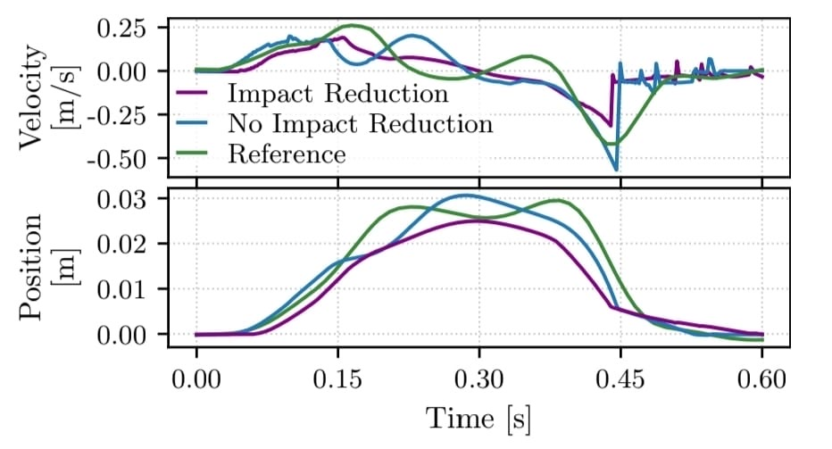
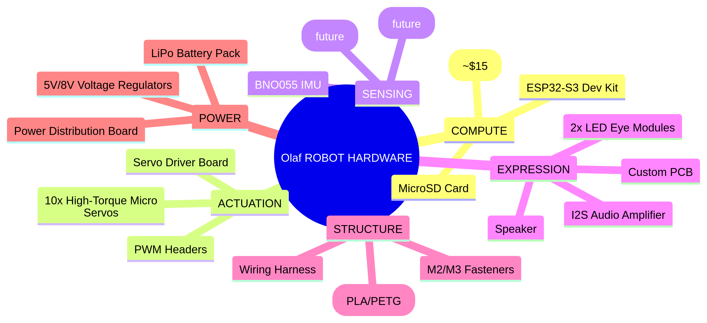

# Olaf Robotics

<p align="center">
  <a href="https://x.com/OlafRobotics"></a>
  <br>
  <code>CA: 8VQBFtkZykbxnAcVzT8jgs7KLcgF5LdByMdna3Dhpump</code>
</p>

<p align="center">
  
</p>

**Olaf Robotics** is an open-source project dedicated to bringing an animated character to life in the physical world. Our goal is to provide a compact, scale-accurate, and highly expressive robotic platform based on the Olaf character, as detailed in the research paper *"Olaf: Bringing an Animated Character to Life in the Physical World"*.


---

## 🌐 Multilingual Documentation / 文档 / Dokumentasi

- [English](#overview)
- [Bahasa Indonesia](#ringkasan)
- [中文 (Chinese)](#项目概述)

---

## Overview

Olaf Robotics is a miniaturized, self-walking robotic character designed for agility and believability. This repository contains the mechatronic design (3D printable parts), high-fidelity simulation environments, and reinforcement learning-based control software.

### 🏗️ Technical Architecture

Our architecture is built on a modular three-layer stack to ensure seamless sim-to-real transition and expressive motion:


### 🧠 Split-Brain Architecture Flow
Our dual-processor system separates locomotion from expression to ensure high-frequency motor control and rich social interaction:



### ⚙️ Mechatronic Design

The robot's internal structure is meticulously designed to balance weight, power, and expressivity. The shells and skirt are cut away in the diagram below to reveal the complex interior:



#### Key Components:
- **Actuators (Yellow)**: High-performance Dynamixel (XH540, XC330, XH430) and Unitree (4010, 8010) motors.
- **Compute (Purple)**: Dual-brain system featuring a **Jetson Computer** for high-level tasks and a **Raspberry Pi** for auxiliary control.
- **Soft PU Foam (Blue)**: Lightweight exterior padding for safety and lifelike feel.
- **Specialized Mechanisms**:
    - **Eye Mechanism**: 3-DoF control for pitch and yaw (left/right) with eyelid movement.
    - **Jaw Linkage**: Precise linkage for expressive mouth movements.
    - **Shoulder Linkage**: Revolute joint axes (red/green) for fluid arm motion.

### 🤖 RL-based Control

We separate the articulated backbone from the show functions. The backbone is controlled via policies conditioned on the high-level control input `gt` and trained using a combination of imitation, overheating, and impact rewards. During training, the control inputs are randomized, whereas at runtime, the Animation Engine generates control inputs from puppeteering commands.


#### Thermal-aware Policy Performance

Our thermal-aware policy effectively prevents actuator overheating, as demonstrated by the comparison below. The policy significantly reduces joint error and torque when operating under thermal constraints.



#### Impact Reduction Performance

To ensure quieter and more believable movement, our RL policies incorporate impact noise reduction rewards. The graph below illustrates how this approach minimizes impact forces during locomotion.



1.  **Mechatronic Design**:
    *   Novel asymmetric **six-degrees-of-freedom (6-DoF)** leg mechanism.
    *   Remotely actuated spherical, planar, and spatial linkages for arms, mouth, and eyes.
    *   Compact design fully hidden beneath a soft foam costume.
2.  **Control Layer (RL & Thermal-aware)**:
    *   **Reinforcement Learning (RL)** policies guided by animation references for lifelike motion.
    *   **Thermal-aware policy** that incorporates actuator temperature to prevent overheating in the slim neck.
    *   Impact noise reduction rewards for quieter, more believable movement.
3.  **Simulation Layer (MuJoCo)**:
    *   High-fidelity physics simulation using **MuJoCo**.
    *   Domain randomization for robust sim-to-real transfer.

### 🛠️ Advanced Features

*   **Polyglot Core Engine**: High-performance components implemented in **C++17**, **C**, and **Rust** for real-time control, low-level communication, and sensor processing.
*   **CI/CD Pipeline**: Automated build and test workflows using GitHub Actions to ensure code stability across multiple languages.
*   **Multilingual Support**: Comprehensive documentation in English, Indonesian, and Chinese.
*   **Modular Design**: Decoupled simulation and hardware layers for rapid prototyping.

---

## Ringkasan

Olaf Robotics adalah proyek robotika open-source yang bertujuan untuk menghidupkan karakter animasi di dunia nyata. Robot ini dirancang dengan fokus pada ekspresi, kelincahan, dan kemiripan dengan karakter aslinya.

### ⚙️ Desain Mekatronik

Struktur internal robot dirancang secara presisi untuk menyeimbangkan berat, daya, dan ekspresivitas. Diagram di bawah menunjukkan komponen interior tanpa kostum:


#### Komponen Utama:
- **Aktuator (Kuning)**: Motor Dynamixel dan Unitree berperforma tinggi.
- **Komputasi (Ungu)**: Sistem dual-brain menggunakan **Jetson Computer** dan **Raspberry Pi**.
- **Mekanisme Khusus**: Kontrol mata 3-DoF, linkage rahang untuk mulut, dan linkage bahu untuk gerakan lengan yang luwes.

### 🤖 Kontrol Berbasis RL

Kami memisahkan *articulated backbone* dari fungsi pertunjukan. *Backbone* dikendalikan melalui kebijakan yang dikondisikan pada input kontrol tingkat tinggi `gt` dan dilatih menggunakan kombinasi imitasi, *overheating*, dan *impact rewards*. Selama pelatihan, input kontrol diacak, sedangkan saat runtime, *Animation Engine* menghasilkan input kontrol dari perintah *puppeteering*.


#### Performa Kebijakan Sadar Termal

Kebijakan sadar termal kami secara efektif mencegah *overheating* aktuator, seperti yang ditunjukkan oleh perbandingan di bawah ini. Kebijakan ini secara signifikan mengurangi kesalahan sendi dan torsi saat beroperasi di bawah batasan termal.


#### Performa Pengurangan Dampak

Untuk memastikan gerakan yang lebih tenang dan meyakinkan, kebijakan RL kami menggabungkan *reward* pengurangan kebisingan dampak. Grafik di bawah ini mengilustrasikan bagaimana pendekatan ini meminimalkan gaya dampak selama lokomosi.


1.  **Desain Mekatronik**: Mekanisme kaki 6-DoF asimetris yang inovatif dan linkage untuk lengan, mulut, dan mata.
2.  **Lapisan Kontrol**: Kebijakan Reinforcement Learning (RL) yang dipandu oleh referensi animasi dan kebijakan sadar termal untuk mencegah overheating.
3.  **Lapisan Simulasi**: Simulasi fisika fidelitas tinggi menggunakan MuJoCo.

---

## 项目概述

Olaf Robotics 是一个开源机器人项目，旨在将动画角色带入现实世界。该机器人专注于表现力、灵活性和与原角色的比例一致性。

### ⚙️ 机电设计

机器人的内部结构经过精心设计，以平衡重量、动力和表现力。下图展示了去除外壳后的内部组件：


#### 核心组件：
- **执行器（黄色）**：高性能 Dynamixel 和 Unitree 电机。
- **计算单元（紫色）**：搭载 **Jetson** 和 **Raspberry Pi** 的双大脑系统。
- **专用机构**：3自由度眼睛机构、用于表情的下颌连杆以及用于流畅手臂动作的肩部连杆。

### 🤖 基于RL的控制

我们将关节骨架与表演功能分离。骨架通过以高级控制输入 `gt` 为条件的策略进行控制，并使用模仿、过热和冲击奖励的组合进行训练。在训练期间，控制输入是随机的，而在运行时，动画引擎从操纵命令生成控制输入。


#### 热感知策略性能

我们的热感知策略有效地防止了执行器过热，如下面的比较所示。该策略在热限制下显著降低了关节误差和扭矩。


#### 冲击减少性能

为了确保更安静、更逼真的运动，我们的强化学习策略结合了冲击噪声减少奖励。下图说明了这种方法如何在运动过程中最大限度地减少冲击力。


1.  **机电设计**：创新的非对称六自由度 (6-DoF) 腿部机构，以及用于手臂、嘴巴和眼睛的远程驱动连杆。
2.  **控制层**：由动画参考引导的强化学习 (RL) 策略，以及包含执行器温度输入的散热感知策略。
3.  **仿真层**：使用 MuJoCo 进行高保真物理仿真。

---

## Getting Started

### Hardware Assembly
Detailed assembly instructions can be found in the [Assembly Guide](docs/assembly_guide.md).

#### 📋 Bill of Materials (BOM)
The total cost for the Olaf Robot hardware is designed to be accessible. Below is the visual breakdown:



### Software Installation
To install the core library and dependencies:
```bash
pip install -e .
```

### Simulation
We use MuJoCo for simulation. You can find the robot descriptions and simulation scripts in the `olaf_robot/robots` and `experiments` directories.

## Project Structure
- `print/`: STL files and 3D printing modifications.
- `olaf_robot/`: Core Python package and robot descriptions.
- `docs/`: Documentation and wiring diagrams.
- `experiments/`: Research scripts for RL, motion planning, and real-robot tests.
- `src/`: Polyglot core engine (C++, C, Rust).
- `scripts/`: Automation and deployment scripts.

## License
This project is licensed under the MIT License - see the [LICENSE](LICENSE) file for details.

---
*Bringing an animated character to life in the physical world.*
